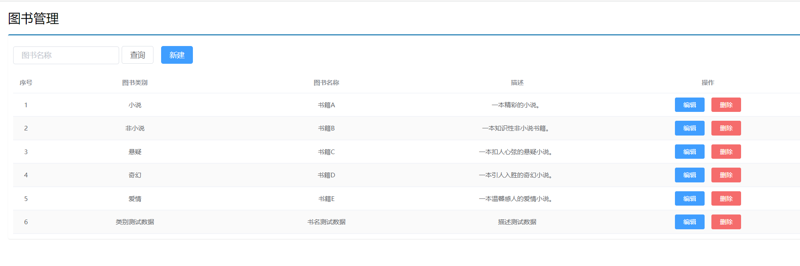

# SpringBoot的DockerCompose部署

## 1. 编写docker-compose.yml文件

```yaml
version: "3"
 
services:
  microService:
    image: ig_springboot:1.6
    container_name: ig01
    ports:
      - "6001:6001"
    volumes:
      - /app/microService:/data
    networks: 
      - ig_net 
    depends_on: 
      - redis
      - mysql
 
  redis:
    image: redis:6.0.8
    ports:
      - "6379:6379"
    volumes:
      - /app/redis/redis.conf:/etc/redis/redis.conf
      - /app/redis/data:/data
    networks: 
      - ig_net
    command: redis-server /etc/redis/redis.conf
 
  mysql:
    image: mysql:5.7
    environment:
      MYSQL_ROOT_PASSWORD: '123456'
      MYSQL_ALLOW_EMPTY_PASSWORD: 'no'
      MYSQL_DATABASE: 'analysedb'
      MYSQL_USER: 'amos'
      MYSQL_PASSWORD: '123456'
      MYSQL_CHARACTER_SET_SERVER: 'utf8mb4' # 解决MySQL无法插入中文数据的问题
      MYSQL_COLLATION_SERVER: 'utf8mb4_unicode_ci'
    ports:
       - "3306:3306"
    volumes:
       - /app/mysql/db:/var/lib/mysql
       - /app/mysql/conf/my.cnf:/etc/my.cnf
       - /app/mysql/init:/docker-entrypoint-initdb.d
    networks:
      - ig_net
    command: --default-authentication-plugin=mysql_native_password #解决外部无法访问
  
  python:
    image: ig_python:1.6
    ports:
      - "5000:5000"
    volumes:
      - /app/python:/data
    networks:
      - ig_net
 
networks: 
   ig_net: 

```

## 2. 修改SpringBoot的yml配置文件

```yaml
# !!!这是一些基本的, 需要的可以新增
server:
  port: 8080
spring:
  datasource:
    type: com.alibaba.druid.pool.DruidDataSource
    driver-class-name: com.mysql.cj.jdbc.Driver
    url: jdbc:mysql://localhost:3306/boss #使用服务名代替IP地址
    username: root
    password: #写自己的密码
mybatis:
  mapper-locations: classpath:mapper/*.xml
logging:
  level:
    com.haut.boss.dao: debug
```

## 3. 打包

* 屏蔽IDEA中Maven项目打包时的test周期


* 在Maven使用package周期将微服务形成新的jar包, 并上传到Linux服务器/mydocker目录下

## 4. 编写Dockerfile文件

```dockerfile
# SpringBoot项目的Dockerfile文件
# 基础镜像使用java
FROM java:8
# 作者
MAINTAINER amos
# VOLUME 指定临时文件目录为/tmp，在主机/var/lib/docker目录下创建了一个临时文件并链接到容器的/tmp
VOLUME /tmp
# 将jar包(!!!jar包名填自己的)添加到容器中并更名为ig.jar
ADD docker_boot-0.0.1-SNAPSHOT.jar ig_docker.jar
# 运行jar包
RUN bash -c 'touch /ig_docker.jar'
ENTRYPOINT ["java","-jar","/ig_docker.jar"]
#暴露6001端口作为微服务
EXPOSE 6001
```

```dockerfile
# 数据分析项目的Dockerfile文件
# 基于的基础镜像Python3.8.2
FROM python:3.8.2
# 作者
MAINTAINER amos
# 代码添加到code文件夹
ADD . /code
# 设置code文件夹是工作目录
WORKDIR /code
# 安装支持
RUN pip install -r requirements.txt
CMD ["python", "/DataPred/app.py"]
# 暴露5000端口进行服务
EXPOSE 5000
```

## 5. 构建镜像

* cd到SpringBoot项目的Dockerfile的目录中
* 执行命令`docker build -t ig_springboot:1.6 .`
* cd到Python项目的Dockerfile的目录中
* 执行命令`docker build -t ig_python:1.6 .`

## 6. 运行DockerCompose文件

* 将 [redis](redis) 目录导入到宿主机/app目录中

* 执行 `docker compose up`或者执行`docker compose up -d`


## 7. 创建MySQL表

* 进入mysql容器实例:`docker exec -it 容器实例id /bin/bash`
* 新建库`analysedb`(这个要和docker-compose文件中的数据库名相同)
* 进入`analysedb`然后创建并导入表的数据

## 8. 测试通过

* 访问SpringBoot的暴露的6001端口, 成功启动

